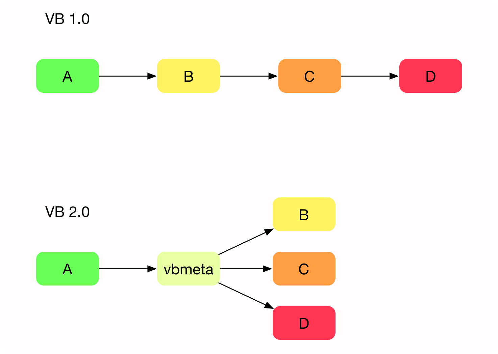
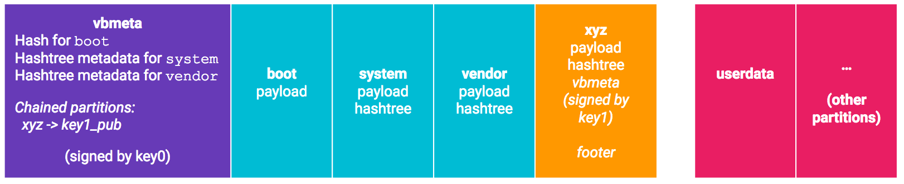

### 什么是avb
* avb全称 android verified boot,是为android设计的一套安全启动软件,用来保证软件的完整性
* avb的上一版本是来自chrome的verified boot,简称vb1.0,所以也称avb是vb2.0
* avb较上一版本改动较大，增加了vbmeta的结构，重新设计了校验流程，下一节详细介绍

### vbmeta结构说明
* 假设有4个image链式启动
    * 在vb1.0中，从A到D，安全启动链上每一个image都包含一个签名，按照顺序一级一级的校验签名。
    * 在vb2.0中，A负责校验vbmeta结构的签名，vbmeta结构除了自己的签名和公钥，还包含了B/C/D的描述（descriptor），可以用于验证B/C/D的完整性和合法性。



* vbmeta包含了需要验证的image对应的描述，描述有三种类型：
    * Hash descriptor
    ```
      Hash descriptor:
      Image Size:            14884864 bytes
      Hash Algorithm:        sha256
      Partition Name:        boot
      Salt:                 d0f619c40f9a51b1c575a415b918534c9a3dab5ec2508780e0e22b8029c3b48b
      Digest:          b4b6fe48c770101cda91a7188b275cfbbf2ec0ec68ee7d1cd3534cb7205066d0
      Flags:                 0
    ```
    * Hash tree descriptor
    * Chained descriptor

下面这个图是最常见的情景


下面这个图是带有chained image的情景，主要用于分开验证某些image



### avb状态说明
avb启动标准中有4中状态

    | 状态  | 说明 |
    | ---  | --- |
    | green |  有锁态，官方合法签名 |
    | yellow | 有锁态，用户合法签名 |
    | orange | 解锁态 |
    | red    | 有锁态，既不是官方合法签名也不是用户合法签名 |


